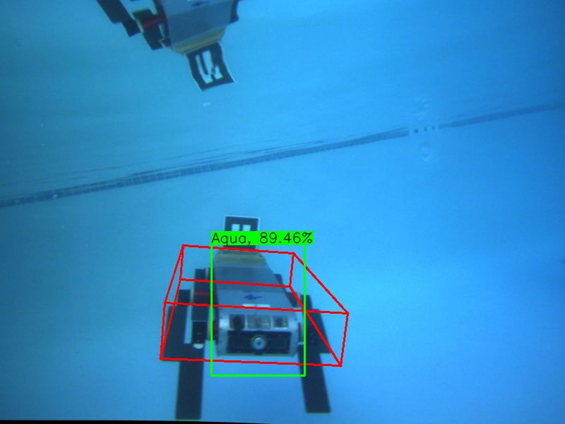

## DeepURL: Deep Pose Estimation Framework for Underwater Relative Localization
Source Code for the paper  **DeepURL: Deep Pose Estimation Framework for Underwater Relative Localization**, 
submitted to IROS 2020. [[Paper]](https://arxiv.org/abs/2003.05523)

### Introduction
We propose a real-time deep-learning approach for determining the 6D relative pose of Autonomous Underwater  Vehicles (AUV) from single image. 
Due  to  the  pro-found difficulty of collecting ground truth images with accurate 6D poses underwater, this work utilizes 
rendered images from the  Unreal  Game  Engine  simulation  for  training.  An  image translation  network  is  employed  to
bridge  the  gap  between the  rendered  and  the  real  images  producing  synthetic  images for  training.  The  proposed
method  predicts  the  6D  pose  of  an AUV  from  a  single  image  as 2D  image  keypoints  representing 8 
corners  of  the  3D  model  of  the  AUV,  and  then  the  6D pose in the camera coordinates is determined using RANSAC-based  PnP. 

[](https://www.youtube.com/watch?v=gh6iDQmETaM)

### Citation
If you find DeepURL useful in your research, please consider citing:

    @misc{joshi2020deepurl,
        title={DeepURL: Deep Pose Estimation Framework for Underwater Relative Localization},
        author={Bharat Joshi and Md Modasshir and Travis Manderson and Hunter Damron and Marios Xanthidis and Alberto Quattrini Li and Ioannis Rekleitis and Gregory Dudek},
        year={2020},
        archivePrefix={arXiv}
    }
    
### Installation
**Packages**
* Python 3, Tensorflow >= 1.8.0, Numpy, tqdm, opencv-python

**Tested on**
* Ubuntu 18.04
* Tensorflow 1.15.0
* python 3.7.6
* Cuda Toolkit 10.0

### Running Demo on Single Image
There are some images from  Pool Dataset under `./data/demo_data`. You can run the demo on single image by
1. Download the pretrained DeepURL checkpoint,`deepurl_checkpoint.zip`, 
from [[GitHub Release ]](https://github.com/joshi-bharat/deep_localization/releases/tag/v1.0) and extract the checkpoint.
2. ```shell script
   python test_single_image.py --input_image data/demo_data/1537054379109932699.jpeg --checkpoint_dir path_to_extracted_checkpoint
   ```
Sample Result:

### Training
*Note: DeepURL only supports one object class until now*

1. Download the pretrained darknet Tensorflow checkpoint,`darknet_weight_checkpoint.zip`, from [[GitHub Release ]](https://github.com/joshi-bharat/deep_localization/releases/tag/v1.0). 
Extract the darknet checkpoint and place inside `./data/darknet_weights/` directory.  

2. Download the synthetic - `synthetic.zip` dataset obtained after image-to-image translation using CycleGAN from [[AFRL DeepURL Dataset]](https://drive.google.com/drive/folders/1F0TxTIQDR1GJoZxdCPi6o5IMV-UyL0FL)
and extract them. The training file is available as `.data/my_data/final_train.txt`. Each line in the training file represents each image
in the format like `image_index image_absolute_path img_width img_height label_index 2D_bounding_box 3D_keypoint_projection`.
2D_bounding_box format: `x_min y_min x_max y_max` top left -> (x_min,y_min) and bottom right -> (x_max, y_max). 3D_keypoint_projection contains
the projections of 8 corners of Aqua (any other object you want to use) 3D object model in the image. 

    For example:
    ```
    0 xxx/xxx/45162.png 800 600 0 445 64 571 234 505 151 519 243 546 227 555 209 586 191 440 119 466 105 458 61 489 44
    1 xxx/xxx/3621.png 800 600 0 194 181 560 475 400 300 356 509 305 417 207 422 166 358 620 243 602 169 442 245 422 191
    ```
    To train change the absolute path of images to the directory where you downloaded and extracted the synthetic dataset.

    Please refer to this [link](label_file_creation.md) for a detailed explanation on how to create labels for your own dataset.

3. Start the training
    ```shell script
    python train.py
    ```  
    The hyper-parameters and the corresponding annotations can be found in [args.py](args.py). For future work, projections of 3D Aqua center are also appended at the end.
    Change nV to 9 in [args.py](args.py) if you want to use center of object as keypoint for training.

### Testing on Pool Dataset