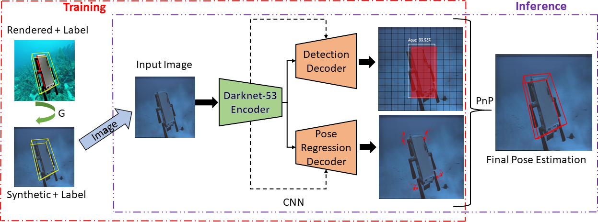

## DeepURL: Deep Pose Estimation Framework for Underwater Relative Localization
Source Code for the paper  **DeepURL: Deep Pose Estimation Framework for Underwater Relative Localization**, 
submitted to IROS 2020. [[Paper]](https://arxiv.org/abs/2003.05523)

### Introduction
We propose a real-time deep-learning approach for determining the 6D relative pose of Autonomous Underwater  Vehicles (AUV) from single image. 
Due  to  the  pro-found difficulty of collecting ground truth images with accurate 6D poses underwater, this work utilizes 
rendered images from the  Unreal  Game  Engine  simulation  for  training.  An  image translation  network  is  employed  to
bridge  the  gap  between the  rendered  and  the  real  images  producing  synthetic  images for  training.  The  proposed
method  predicts  the  6D  pose  of  an AUV  from  a  single  image  as 2D  image  keypoints  representing 8 
corners  of  the  3D  model  of  the  AUV,  and  then  the  6D pose in the camera coordinates is determined using RANSAC-based  PnP. 

### Citation
If you find DeepURL useful in your research, please consider citing:

    @misc{joshi2020deepurl,
        title={DeepURL: Deep Pose Estimation Framework for Underwater Relative Localization},
        author={Bharat Joshi and Md Modasshir and Travis Manderson and Hunter Damron and Marios Xanthidis and Alberto Quattrini Li and Ioannis Rekleitis and Gregory Dudek},
        year={2020},
        archivePrefix={arXiv}
    }
    
### Installation
**Packages**
* Python 3, Tensorflow >= 1.8.0, Numpy, tqdm, opencv-python

**Tested on**
* Ubuntu 18.04
* Tensorflow 1.15.0
* python 3.7.6
* Cuda Toolkit 10.0

### Running Demo

### Training
Download the pretrained darknet Tensorflow checkpoint,`darknet_weight_checkpoint.zip`, from [[GitHub Release ]](https://github.com/joshi-bharat/deep_localization/releases/tag/v1.0).

Extract the darknet checkpoint and place inside `./data/darknet_weights/` directory.  

Download the synthetic dataset obtained after image-to-image translation using CycleGAN from [[AFRL DeepURL Dataset]](https://drive.google.com/drive/folders/1F0TxTIQDR1GJoZxdCPi6o5IMV-UyL0FL)
and extract them.
